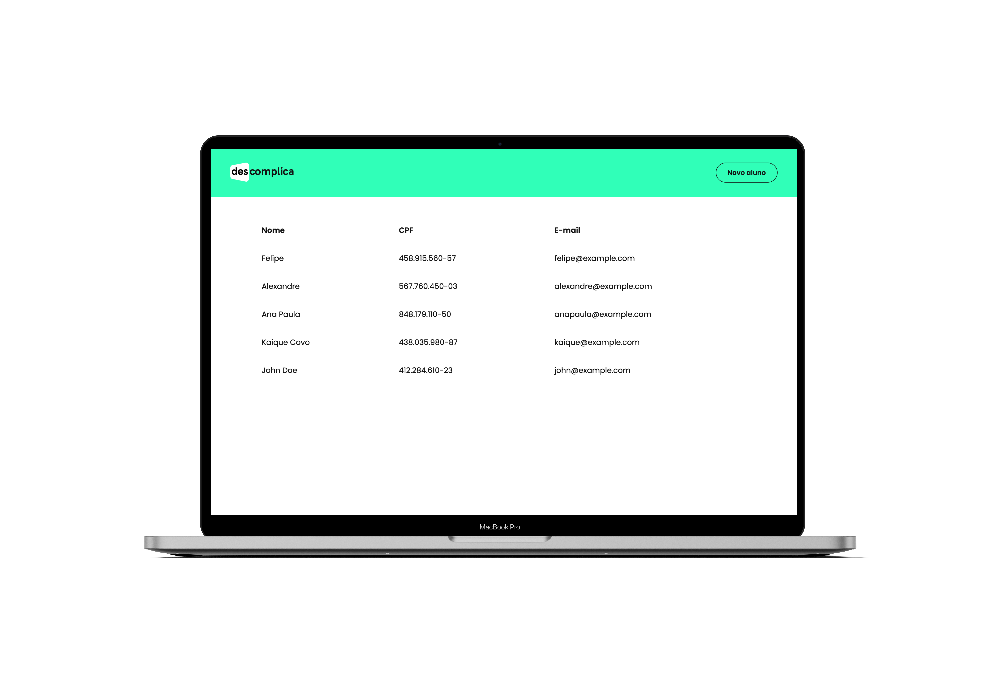

<div align="center">

<!-- Badges -->


<!-- Menu -->
<p align="center" >
  <a href="#bookmark_tabs-about-the-project">:bookmark_tabs:&nbsp;&nbsp;About the project</a>&nbsp;&nbsp;&nbsp;|&nbsp;&nbsp;&nbsp;
  <a href="#rocket-technologies">:rocket:&nbsp;&nbsp;Technologies</a>&nbsp;&nbsp;&nbsp;|&nbsp;&nbsp;&nbsp;
  <a href="#information_source-how-to-use">:information_source:&nbsp;&nbsp;How To Use</a>
</p>

<!-- Mockup -->
<div  align="center" style="padding: 50px;">
  
</div>

</div>

<!-- About -->

## :bookmark_tabs: About the project

Web application for add students. This is challenge from Descomplica

<!-- Technologies -->

## :rocket: Technologies

This project was developed at challenge [Descomplica](https://descomplica.com.br) with the following technologies:

- [ReactJS](https://reactjs.org/)
- [Styled Components](https://styled-components.com/)
- [TypeScript](https://www.typescriptlang.org/)
- [GraphQL](https://graphql.org/)
- [Apollo Client](https://www.apollographql.com/docs/react/)
- [Docker](https://www.docker.com/)
- [Formik](https://formik.org/)
- [Yup](https://www.npmjs.com/package/yup)
- [React Modal](https://github.com/reactjs/react-modal)
- [React Input Mask](https://www.npmjs.com/package/react-input-mask)
- [Prettier](https://prettier.io/)
- [Eslint](https://eslint.org/)

<!-- How to use -->

## :information_source: How To Use

To clone and run this application, you'll need [Git](https://git-scm.com), [Node.js v10.16](https://nodejs.org/en) or higher + [Yarn v1.13](https://yarnpkg.com) or higher installed on your computer. Run from your command line:

```bash
# Clone this repository
$ git clone git@github.com:KaiqueCovo/descomplica-frontend-challenge.git

# Go into the repository
$ cd descomplica-frontend-challenge

# Copy .env.example to .env
$ cp -rf .env.example .env

# Run the container (Immature)
$ docker compose run

# Install dependencies
$ yarn
# or
$ npm run install

# Run the app
$ yarn start
# or
$ npm run start
```

---

Made with ♥ by [Kaique Covo](https://www.linkedin.com/in/kaique-covo-a46331147/) :wave:
